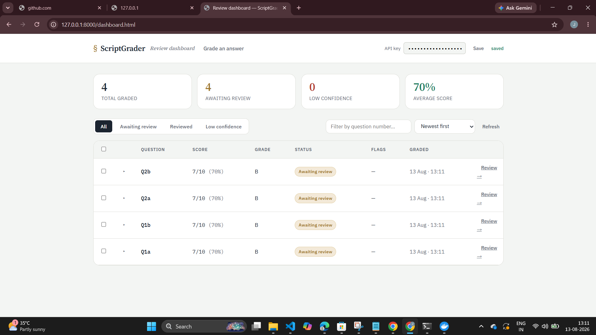

# ScriptGrader

[](https://www.python.org/)
[](https://fastapi.tiangolo.com/)
[](LICENSE)
[](tests/)

AI-powered handwritten answer sheet grading with evidence and rubric
scoring. This FastAPI app accepts scanned student answers, grades
them using a vision-capable model, and returns structured results with a
clear reason and evidence for every awarded mark — now with per-user
authentication and role-based access control.

---

## Demo & Screenshots

### Product Overview

![ScriptGrader product overview] (docs/overview.png)
*End-to-end workflow: define rubric, upload answer, AI evaluation, evidence, human review*

### Grading Interface


*Question, model answer, and marking rubric configured before uploading the answer sheet*

### Handwritten Answer as Evidence


*A scanned handwritten answer used as grading evidence*

### Review Dashboard


*Total graded, awaiting review, low-confidence count, and average score at a glance*

---

## How it works

```
Sheet image + rubric
       |
       v
┌─────────────────┐
│  Preprocessing   │   validate file, fix orientation, check size/contrast
└─────────────────┘
       |
       v
┌─────────────────┐
│  Draft scoring   │   vision model reads the sheet against the rubric
└─────────────────┘
       |
       v
┌─────────────────┐
│  Verification    │   second pass checks evidence and marks for consistency
└─────────────────┘
       |
       v
┌─────────────────┐
│  Persistence     │   saved via SQLAlchemy, available for review/override
└─────────────────┘
```

Every awarded mark comes back with a **reason** and **evidence** quoted
from the sheet, not just a number — so a teacher can verify or override it.

---

## Quick start

Works the same on Windows, macOS, and Linux — commands differ only where noted.

```bash
git clone https://github.com/janbidhiman0403/ScriptGrader.git
cd ScriptGrader

python -m venv .venv
```

Activate the virtual environment:

```bash
# Windows (PowerShell)
.\.venv\Scripts\Activate.ps1

# macOS / Linux
source .venv/bin/activate
```

Install and configure:

```bash
pip install -r requirements.txt

# Windows
copy .env.example .env

# macOS / Linux
cp .env.example .env
```

Edit `.env` and set `ANTHROPIC_API_KEY`, `TEACHER_API_KEY`, and `SECRET_KEY`
(used to sign JWT tokens), then run:

```bash
uvicorn app.main:app --reload
```

Open `http://127.0.0.1:8000` in your browser. On first launch, register the
first account — it automatically becomes the **admin**.

---

## What this project does

- Accepts handwritten answer sheet images and grading metadata.
- Preprocesses uploads: file validation, orientation, size limit, contrast.
- Grades with a two-pass model flow: draft scoring, then verification.
- Enforces schema validation via Pydantic to keep marks consistent.
- Persists evaluations and supports review/overrides via a simple API.
- Authenticates users with JWT and enforces role-based access (admin/teacher).
- Serves a static frontend from `static/` with no separate build step.

## Project layout

```
app/
  main.py              FastAPI entrypoint and centralized error handling
  api/
    routes.py          HTTP routes for grading, batch grading, reviews
    routes_auth.py      HTTP routes for register, login, user management
  core/
    auth.py            shared-key API auth (grading endpoints)
    security.py        JWT issuing/verification and password hashing
    config.py          environment-backed settings
    exceptions.py      domain-specific error classes
    logging.py         structured logging setup
    limiter.py         rate limiting configuration
  db/
    database.py        SQLAlchemy engine and session management
    models.py          persisted evaluation record model
    models_user.py     user account model and roles
  schemas/
    evaluation.py      Pydantic schemas for grading requests/responses
    auth.py            Pydantic schemas for auth requests/responses
  services/
    preprocess.py      image validation and preprocessing logic
    prompt.py          prompt templates used by the grading engine
    engine.py          two-pass grading orchestration
    persistence.py     save/load/override evaluation records
static/
  index.html, styles.css, app.js   frontend UI served directly by FastAPI
tests/                 pytest coverage for schema, API, auth, and services
docs/
  screenshot-*.png     README media showing UI, auth, and grading results
```

## Environment configuration

Create `.env` from `.env.example` and set at minimum:

| Variable              | Purpose                                       | Default                       |
| --------------------- | --------------------------------------------- | ----------------------------- |
| `ANTHROPIC_API_KEY`   | required unless `MOCK_GRADING=true`           | —                             |
| `TEACHER_API_KEY`     | shared key for legacy-protected grading routes | —                             |
| `SECRET_KEY`          | signs JWT access tokens                       | —                             |
| `DATABASE_URL`        | database connection string                    | `sqlite:///./scriptgrader.db` |
| `MOCK_GRADING`        | `true` for local dev without a real model key | `false`                       |
| `ALLOWED_ORIGINS`     | comma-separated CORS origins                  | —                             |
| `RATE_LIMIT_GRADE`    | grading endpoint rate limit                   | `10/minute`                   |
| `MAX_UPLOAD_MB`       | max upload size                               | —                             |
| `MAX_IMAGE_DIMENSION` | max accepted image dimension                  | —                             |

## Running in mock mode

When `MOCK_GRADING=true`, the app runs without calling a real model.
This is useful for frontend development and testing, but it always returns
the same canned evaluation. Do not use mock mode for production grading.

## API

### Authentication endpoints

| Method | Endpoint            | Purpose                              | Access        |
| ------ | -------------------- | ------------------------------------- | ------------- |
| POST   | `/api/auth/register` | Create the first account (becomes admin) | Open once     |
| POST   | `/api/auth/login`    | Authenticate, returns JWT access token | Open          |
| POST   | `/api/auth/users`    | Create additional users                | Admin only    |
| GET    | `/api/auth/me`       | Return the authenticated user          | Bearer token  |

Pass the returned token as `Authorization: Bearer <token>` on subsequent
requests.

### Grading and review endpoints

All grading and review endpoints require `X-API-Key: <TEACHER_API_KEY>`.

#### `POST /api/grade`

Submit one handwritten answer for grading.

Fields:

- `sheet_image` — file (JPEG/PNG/WebP)
- `question_number` — string, e.g. `"1a"`
- `question_text` — string
- `model_answer` — string
- `rubric_json` — string containing JSON array of rubric items

Example rubric JSON:

```json
[
  {"name": "Accuracy", "max_marks": 5, "description": "Correct answer points"},
  {"name": "Presentation", "max_marks": 3, "description": "Neatness and clarity"}
]
```

Returns `EvaluationResult` with per-criterion `awarded`, `evidence`, and `reason`.

#### `POST /api/grade/batch`

Submit multiple sheet images for the same question and rubric.

- `sheet_images` — multiple files
- other fields are the same as `/api/grade`

The response is a list of results. A single failed sheet does not abort the
whole batch.

#### `GET /api/evaluations`

Returns persisted evaluations.

Query parameters:

- `limit` — maximum number of records
- `offset` — pagination offset
- `batch_id` — filter results for a specific batch

#### `GET /api/evaluations/{evaluation_id}`

Fetch one saved evaluation by ID.

#### `PATCH /api/evaluations/{evaluation_id}`

Override awarded marks for one evaluation.
The server recomputes `total_awarded` from the updated criteria.

## Authentication & Roles

ScriptGrader now has two authentication layers:

1. **Shared API key** (`X-API-Key`) — still required on grading/review
   endpoints (`/api/grade`, `/api/grade/batch`, `/api/evaluations*`).
2. **Per-user JWT authentication** — used for account login and
   admin-only user management (`/api/auth/*`).

Roles:

- **admin** — the first registered account; can create additional users
- **teacher** — standard account; can log in and view `/api/auth/me`

Passwords are stored using a password-hashing layer (never plaintext), and
JWT tokens are signed with `SECRET_KEY`. Registration is open only for the
first account — every account after that is created by an admin via
`POST /api/auth/users`.

> Note: per-user JWT identity has not yet fully replaced the shared API key
> on the grading endpoints. Both mechanisms currently coexist.

## Docker

To run with Docker Compose:

```bash
cp .env.example .env
# edit .env and set required values, including POSTGRES_PASSWORD and SECRET_KEY

docker compose up -d --build
```

The compose stack starts:

- `app` — FastAPI app behind gunicorn/uvicorn
- `db` — PostgreSQL database

The app waits for Postgres readiness before starting, and data persists in
a named volume.

## Tests

```bash
pip install -r requirements-dev.txt
pytest tests/ -v
```

Tests cover:

- schema validation and rule enforcement
- image preprocessing and size limits
- API request validation and error handling
- grading engine and prompt behavior
- user registration, login, and role checks

## Notes

- Results are persisted through SQLAlchemy. The default local database is
  SQLite, but `DATABASE_URL` supports PostgreSQL and other SQLAlchemy
  backends.
- The frontend is served from `static/` directly by FastAPI, so no separate
  frontend build step is required.
- `MOCK_GRADING=true` is only for development and demo mode.
- The app now supports per-user login in addition to the shared API key.

## Known limitations

- No audit log yet of which user performed a specific override.
- Shared API key still guards grading endpoints; full per-user authorization
  on those routes is in progress.
- The live grading quality depends on the chosen vision model and real
  handwriting samples; verify with real scans before using in production.

## Roadmap

- [x] Per-user authentication (JWT) and role-based access
- [x] Audit log for overrides tied to the authenticated user
- [x] Richer teacher review UI (batch review, diffing regrades)
- [ ] Export evaluations to CSV/PDF for record-keeping
- [ ] Move grading endpoints fully to per-user authorization
- [x] CI workflow to run tests automatically on push

## Contributing

Issues and pull requests are welcome. Before opening a PR:

1. Run `pytest tests/ -v` and make sure everything passes.
2. Keep new endpoints documented in this README.
3. Follow the existing project layout — put business logic in `services/`,
   not in route handlers.

## License

This project is licensed under the MIT License — see [LICENSE](LICENSE) for details.
