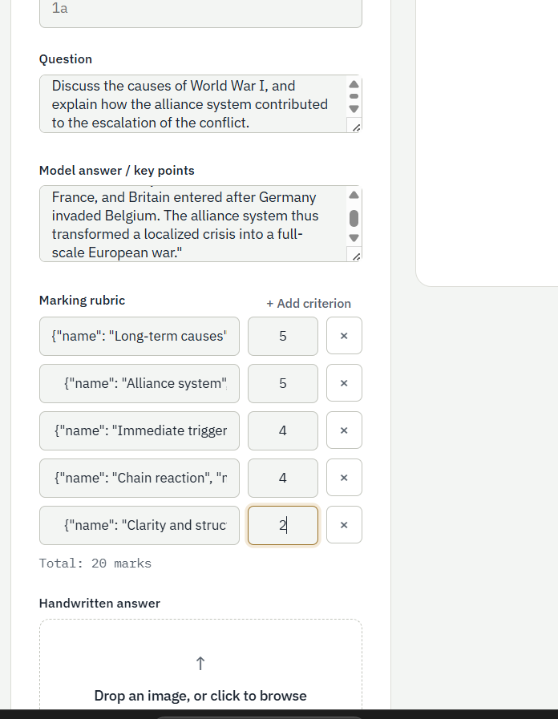

# ScriptGrader


rubric scoring. This FastAPI app accepts scanned student answers, grades
them using a vision-capable model, and returns structured results with a
clear reason and evidence for every awarded mark.

---

## Demo & Screenshots

### Grading Interface

*Upload handwritten answer sheet with question, model answer, and rubric criteria*

### Grading Form with Question Details

*Complete form showing question, model answer, marking rubric, and file upload*

### Evaluation Results

*Graded answers with every mark tied to exact line it came from*

### Recent Evaluations

*View history of all graded answers with scores and percentages*

---

## How it works

```
 Sheet image + rubric
        |
        v
 ┌─────────────────┐
 │  Preprocessing   │   validate file, fix orientation, check size/contrast
 └─────────────────┘
        |
        v
 ┌─────────────────┐
 │  Draft scoring   │   vision model reads the sheet against the rubric
 └─────────────────┘
        |
        v
 ┌─────────────────┐
 │  Verification    │   second pass checks evidence and marks for consistency
 └─────────────────┘
        |
        v
 ┌─────────────────┐
 │  Persistence     │   saved via SQLAlchemy, available for review/override
 └─────────────────┘
```

Every awarded mark comes back with a **reason** and **evidence** quoted
from the sheet, not just a number — so a teacher can verify or override it.

---

## Quick start

Works the same on Windows, macOS, and Linux — commands differ only where noted.

```bash
git clone https://github.com/janbidhiman0403/ScriptGrader.git
cd ScriptGrader

python -m venv .venv
```

Activate the virtual environment:

```bash
# Windows (PowerShell)
.\.venv\Scripts\Activate.ps1

# macOS / Linux
source .venv/bin/activate
```

Install and configure:

```bash
pip install -r requirements.txt

# Windows
copy .env.example .env

# macOS / Linux
cp .env.example .env
```

Edit `.env` and set `ANTHROPIC_API_KEY` and `TEACHER_API_KEY`, then run:

```bash
uvicorn app.main:app --reload
```

Open `http://127.0.0.1:8000` in your browser.

---

## What this project does

- Accepts handwritten answer sheet images and grading metadata.
- Preprocesses uploads: file validation, orientation, size limit, contrast.
- Grades with a two-pass model flow: draft scoring, then verification.
- Enforces schema validation via Pydantic to keep marks consistent.
- Persists evaluations and supports review/overrides via a simple API.
- Serves a static frontend from `static/` with no separate build step.

## Project layout

```
app/
  main.py              FastAPI entrypoint and centralized error handling
  api/routes.py        HTTP routes for grading, batch grading, reviews
  core/
    auth.py            shared-key API auth
    config.py          environment-backed settings
    exceptions.py      domain-specific error classes
    logging.py         structured logging setup
    limiter.py         rate limiting configuration
  db/
    database.py        SQLAlchemy engine and session management
    models.py          persisted evaluation record model
  schemas/
    evaluation.py      Pydantic schemas for grading requests/responses
  services/
    preprocess.py      image validation and preprocessing logic
    prompt.py          prompt templates used by the grading engine
    engine.py          two-pass grading orchestration
    persistence.py     save/load/override evaluation records
static/
  index.html, styles.css, app.js   frontend UI served directly by FastAPI
tests/                 pytest coverage for schema, API, and services
docs/
  screenshots-*.png    README media showing UI and grading results
```

## Environment configuration

Create `.env` from `.env.example` and set at minimum:

| Variable | Purpose | Default |
|---|---|---|
| `ANTHROPIC_API_KEY` | required unless `MOCK_GRADING=true` | — |
| `TEACHER_API_KEY` | required for all protected API endpoints | — |
| `DATABASE_URL` | database connection string | `sqlite:///./scriptgrader.db` |
| `MOCK_GRADING` | `true` for local dev without a real model key | `false` |
| `ALLOWED_ORIGINS` | comma-separated CORS origins | — |
| `RATE_LIMIT_GRADE` | grading endpoint rate limit | `10/minute` |
| `MAX_UPLOAD_MB` | max upload size | — |
| `MAX_IMAGE_DIMENSION` | max accepted image dimension | — |

## Running in mock mode

When `MOCK_GRADING=true`, the app runs without calling a real model.
This is useful for frontend development and testing, but it always returns
the same canned evaluation. Do not use mock mode for production grading.

## API

All grading and review endpoints require `X-API-Key: <TEACHER_API_KEY>`.

### `POST /api/grade`

Submit one handwritten answer for grading.

Fields:

- `sheet_image` — file (JPEG/PNG/WebP)
- `question_number` — string, e.g. `"1a"`
- `question_text` — string
- `model_answer` — string
- `rubric_json` — string containing JSON array of rubric items

Example rubric JSON:

```json
[
  {"name": "Accuracy", "max_marks": 5, "description": "Correct answer points"},
  {"name": "Presentation", "max_marks": 3, "description": "Neatness and clarity"}
]
```

Returns `EvaluationResult` with per-criterion `awarded`, `evidence`, and
`reason`.

### `POST /api/grade/batch`

Submit multiple sheet images for the same question and rubric.

- `sheet_images` — multiple files
- other fields are the same as `/api/grade`

The response is a list of results. A single failed sheet does not abort the
whole batch.

### `GET /api/evaluations`

Returns persisted evaluations.

Query parameters:

- `limit` — maximum number of records
- `offset` — pagination offset
- `batch_id` — filter results for a specific batch

### `GET /api/evaluations/{evaluation_id}`

Fetch one saved evaluation by ID.

### `PATCH /api/evaluations/{evaluation_id}`

Override awarded marks for one evaluation.
The server recomputes `total_awarded` from the updated criteria.

## Authentication

The app uses a single shared API key for protected routes.
Set `X-API-Key` on every request to `/api/grade`, `/api/grade/batch`,
`/api/evaluations`, and `/api/evaluations/{id}`.

This approach is suitable for a small trusted deployment. For larger
multi-user deployments, replace `app/core/auth.py` with proper user-based
authentication and authorization.

## Docker

To run with Docker Compose:

```bash
cp .env.example .env
# edit .env and set required values, including POSTGRES_PASSWORD

docker compose up -d --build
```

The compose stack starts:

- `app` — FastAPI app behind gunicorn/uvicorn
- `db` — PostgreSQL database

The app waits for Postgres readiness before starting, and data persists in
a named volume.

## Tests

```bash
pip install -r requirements-dev.txt
pytest tests/ -v
```

Tests cover:

- schema validation and rule enforcement
- image preprocessing and size limits
- API request validation and error handling
- grading engine and prompt behavior

## Notes

- Results are persisted through SQLAlchemy. The default local database is
  SQLite, but `DATABASE_URL` supports PostgreSQL and other SQLAlchemy
  backends.
- The frontend is served from `static/` directly by FastAPI, so no separate
  frontend build step is required.
- `MOCK_GRADING=true` is only for development and demo mode.
- The app currently uses shared-key auth, not per-user login.

## Known limitations

- No per-user authentication or audit log of who performed overrides.
- No production-grade user interface for teacher review and regrade flows.
- The live grading quality depends on the chosen vision model and real
  handwriting samples; verify with real scans before using in production.

## Roadmap

- [ ] Per-user authentication and audit log for overrides
- [ ] Richer teacher review UI (batch review, diffing regrades)
- [ ] Export evaluations to CSV/PDF for record-keeping
- [ ] CI workflow to run tests automatically on push

## Contributing

Issues and pull requests are welcome. Before opening a PR:

1. Run `pytest tests/ -v` and make sure everything passes.
2. Keep new endpoints documented in this README.
3. Follow the existing project layout — put business logic in `services/`,
   not in route handlers.

## License

This project is licensed under the MIT License — see [LICENSE](LICENSE) for details.
